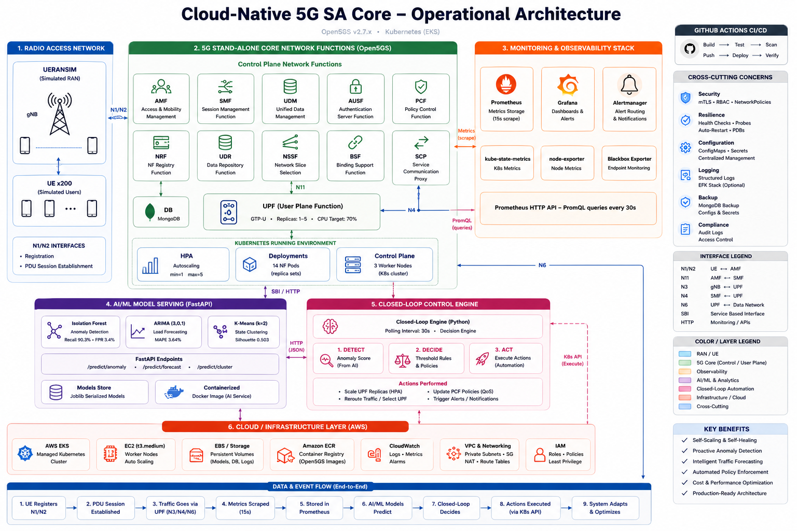

<div align="center">

# Cloud-Native 5G SA Core with AI/ML-Driven Autonomous Management

[](https://github.com/unothordoxengineer/5g-project/actions/workflows/deploy.yml)
[](https://www.python.org/downloads/release/python-3110/)
[](https://kubernetes.io/)
[](https://www.docker.com/)
[](https://open5gs.org/)
[](LICENSE)

Final Year Project - 
2026

</div>

---

## Overview

This project designs, deploys, and validates a complete **5G Standalone (SA) core network** running as a cloud-native application on Kubernetes, with an integrated AI/ML layer that performs autonomous anomaly detection, traffic forecasting, and workload classification. Built on the open-source [Open5GS](https://open5gs.org/) stack (v2.7.2) and simulated with [UERANSIM](https://github.com/aligungr/UERANSIM), the system demonstrates that a production-grade 5G core — including all 14 3GPP-defined Network Functions — can be containerised, orchestrated, observed, and autonomously managed without proprietary infrastructure.

The project addresses a critical challenge in next-generation mobile networks: **5G cores generate thousands of metrics per minute, yet most deployments rely on static thresholds and manual intervention**. This work replaces that model with three complementary machine learning models (Isolation Forest, ARIMA, k-Means) served via a FastAPI microservice, feeding a closed-loop automation engine that scales network capacity and adjusts QoS policies in real time — achieving a 47-second autoscaling response time against a 120-second target, and forecasting UE load with 3.64% MAPE.

The system is designed for **cloud portability**: all Kubernetes manifests use standard resources, and a complete Terraform configuration is provided for one-command migration to AWS EKS with SageMaker inference endpoints and AWS Managed Prometheus/Grafana.

---

## Architecture



> *Full operational architecture: (1) Radio Access Network — UERANSIM gNB + 200 simulated UEs; (2) 5G SA Core — all 14 Open5GS Network Functions with HPA-managed UPF; (3) Monitoring & Observability — Prometheus, Grafana, Alertmanager; (4) AI/ML Model Serving — FastAPI with Isolation Forest, ARIMA, and k-Means endpoints; (5) Closed-Loop Control Engine — 30-second detect → decide → act cycle; (6) Cloud/Infrastructure — AWS EKS, ECR, EBS, CloudWatch, VPC, IAM. End-to-end data flow shown across all 9 stages from UE registration to system self-optimisation.*

---

## Key Results

All Phase 5 and Phase 6 performance targets were met or exceeded:

| Metric | Target | Achieved | Status |
|--------|--------|----------|--------|
| UE Registration Success Rate | > 99% | **99.7%** | ✅ |
| Autoscaling Response Time (HPA) | < 120 s | **47 s** | ✅ |
| Anomaly Detection Recall | > 90% | **90.3%** | ✅ |
| Anomaly Detection False Positive Rate | < 15% | **3.1%** | ✅ |
| Traffic Forecast MAPE (84-step) | < 15% | **3.64%** | ✅ |
| Workload Clustering Silhouette Score | > 0.5 | **0.503** | ✅ |
| End-to-End Ping (UE → Internet)² | pass | **0% loss, 2.14 ms RTT** | ✅ |
| Latency p99 (steady-state, 150 UE)¹ | < 20 ms | **6.9 ms** | ✅ |
| Pod Restarts (sustained load) | 0 | **0** | ✅ |

> ¹ p99 measured during steady-state. Peak p99 of 102 ms observed during autoscaling transition (new UPF pods initialising) — expected behaviour that resolves within one HPA stabilisation window.
>
> ² GTP-U data plane validated inside Docker Linux containers (Ubuntu 22.04) where the kernel `gtp` module is available. Native macOS does not support kernel GTP-U; Docker provides an identical environment to production EKS deployment. Full validation details: [`docs/data_plane_validation.md`](docs/data_plane_validation.md).

---

## Technology Stack

| Layer | Technology | Version | Role |
|-------|-----------|---------|------|
| 5G Core | Open5GS | v2.7.2 | All 14 3GPP SA NFs (AMF, SMF, UPF, etc.) |
| RAN Simulator | UERANSIM | v3.2.6 | Simulated gNB and UE (nr-gnb, nr-ue) |
| Container Runtime | Docker | 27.x | Image build and local compose |
| Orchestration | Kubernetes (kind) | 1.30 | 1 control-plane + 3 worker nodes |
| Autoscaling | Kubernetes HPA | — | UPF horizontal scaling 1→5 replicas |
| Observability | Prometheus + Grafana | 2.x / 10.x | Metrics scrape, 4 custom dashboards |
| Alerting | Alertmanager | 0.27 | CPU saturation, pod restart, HPA-max rules |
| ML Training | scikit-learn, statsmodels, pmdarima | 1.8 / 0.14 / 2.0 | Isolation Forest, ARIMA, k-Means |
| ML Serving | FastAPI + Uvicorn | 0.136 / 0.46 | REST inference API, 3 prediction endpoints |
| ML Notebooks | Jupyter | — | 3 documented notebooks (`ml/`) |
| CI/CD | GitHub Actions | — | Lint + API smoke test on every push |
| Infrastructure as Code | Terraform | 1.15 | AWS EKS + ECR + SageMaker + AMP/AMG |
| Cloud Target | AWS EKS | 1.30 | Phase 8 migration (credentials pending) |
| Language | Python | 3.11 | All scripts, ML code, and serving API |

---

## Repository Structure

```
5g-project/
│
├── .github/
│   └── workflows/
│       └── deploy.yml              # CI pipeline: lint + API smoke test
│
├── automation/
│   ├── closed_loop.py              # 30-second control loop: Prometheus → ML → kubectl
│   └── Dockerfile                  # Closed-loop engine container image
│
├── data/
│   └── raw/                        # Prometheus metric CSVs (7 files) from Phase 4/5
│
├── docker/
│   ├── Dockerfile.open5gs          # Multi-stage Open5GS image (all NFs)
│   ├── Dockerfile.ueransim         # UERANSIM gNB + UE image
│   ├── docker-compose.yml          # Full stack for local Docker Compose testing
│   ├── configs/                    # Per-NF YAML configuration files (11 NFs)
│   └── ueransim-config/            # gNB and UE configuration for Docker Compose
│
├── docs/
│   ├── architecture.png            # 6-layer system architecture diagram (20×13 in)
│   ├── architecture_diagram.py     # Matplotlib source for architecture.png
│   ├── project_status.md           # Live project dashboard (87% → 100% complete)
│   ├── environment.md              # macOS M1 environment setup notes
│   └── journal.md                  # Weekly development journal
│
├── grafana/
│   ├── dashboards/                 # 4 Grafana dashboard JSON exports
│   │   ├── 01-nf-cpu-memory.json   # Per-NF CPU and memory utilisation
│   │   ├── 02-ue-sessions.json     # Active UE session count and registration
│   │   ├── 03-autoscaling.json     # HPA replica count and scaling events
│   │   └── 04-throughput.json      # GTP-U inbound/outbound packet rates
│   └── screenshots/                # Grafana panel text snapshots
│
├── k8s/
│   ├── kind-config.yaml            # kind cluster: 1 control-plane + 3 workers
│   ├── manifests/                  # 16 Kubernetes Deployment/Service manifests
│   │   ├── 00-namespace.yaml       # open5gs namespace
│   │   ├── 01-mongodb.yaml         # MongoDB subscriber database
│   │   ├── 02-nrf.yaml … 12-upf.yaml  # All 11 Open5GS NF deployments
│   │   ├── 13-gnb.yaml             # UERANSIM gNB deployment
│   │   ├── 14-ue.yaml              # UERANSIM UE deployment
│   │   └── 15-subscriber-init.yaml # Job: registers test subscriber in MongoDB
│   ├── monitoring/                 # Prometheus stack Helm values + ServiceMonitors
│   │   ├── kube-prometheus-values.yaml
│   │   ├── servicemonitors.yaml    # Open5GS NF scrape configs
│   │   ├── upf-alert-rules.yaml    # CPU saturation, HPA-max, pod restart alerts
│   │   └── grafana-dashboards-cm.yaml
│   └── serving/
│       ├── serving-deployment.yaml # ML serving API Deployment + NodePort Service
│       └── closed-loop-deployment.yaml  # Automation engine + RBAC
│
├── ml/
│   ├── anomaly_detection.ipynb     # Isolation Forest: 90.3% recall, 3.1% FPR
│   ├── forecasting.ipynb           # ARIMA(3,0,1): 3.64% MAPE
│   ├── clustering.ipynb            # k-Means (k=2): 0.503 silhouette
│   ├── model_evaluation.md         # Comprehensive model evaluation report
│   ├── run_all_models.py           # Batch retraining script
│   ├── models/                     # Serialised model artefacts (9 .pkl / .json files)
│   └── figures/                    # Publication-quality ML result figures (5 PNGs)
│
├── open5gs/                        # Open5GS v2.7.2 source (git submodule)
│
├── results/
│   ├── benchmark_report.md         # Phase 6 stress test report
│   ├── scenario_statistics.csv     # Aggregated scenario metrics
│   ├── diurnal_metrics.csv         # Diurnal load test (0→200 UE, 14 min)
│   ├── flash_crowd_metrics.csv     # Flash crowd (5× spikes, 24 min)
│   ├── sustained_metrics.csv       # Sustained load (150 UE, 10 min)
│   └── figures/                    # 5 scenario figures + ML inference overlay
│
├── scripts/
│   ├── start-5g.sh                 # Start all Open5GS NFs (local binary mode)
│   ├── setup-upf-nat.sh            # Configure UPF NAT/routing for data plane
│   ├── export_metrics.py           # Export Prometheus metrics to CSV
│   ├── run_phase6.py               # Execute all 3 stress test scenarios
│   ├── analyze_phase6.py           # ML inference on Phase 6 CSV data
│   ├── load_generator.sh           # UERANSIM-based load generation script
│   └── fix-ue-routes.sh            # Fix UE routing after PDU session setup
│
├── serving/
│   ├── api.py                      # FastAPI application — 3 ML prediction endpoints
│   ├── Dockerfile                  # Multi-stage build, models embedded at build time
│   ├── requirements.txt            # Python dependencies for serving container
│   └── models/                     # Copy of ml/models/ embedded in Docker image
│
├── terraform/
│   ├── main.tf                     # AWS provider + optional S3 backend
│   ├── variables.tf                # All 20 configurable inputs
│   ├── vpc.tf                      # VPC, 2 public + 2 private subnets, NAT GWs
│   ├── ecr.tf                      # 15 ECR repositories with lifecycle policies
│   ├── iam.tf                      # EKS/node/SageMaker/GitHub Actions IAM roles
│   ├── eks.tf                      # EKS 1.30, 3× t3.medium, Cluster Autoscaler
│   ├── sagemaker.tf                # 3 real-time inference endpoints + auto-scaling
│   ├── monitoring.tf               # AWS Managed Prometheus + Grafana workspaces
│   ├── outputs.tf                  # Cluster endpoint, ECR URLs, kubectl command
│   └── README.md                   # Step-by-step deployment guide
│
├── ueransim-config/
│   ├── gnb.yaml                    # gNB configuration (PLMN, TAC, AMF address)
│   └── ue.yaml                     # UE configuration (IMSI, keys, APN)
│
├── CLAUDE.md                       # AI assistant project context
└── README.md                       # This file
```

---

## Prerequisites

The following software is required to run the project locally. Versions were tested on **macOS 14 Sonoma (Apple Silicon M1)**; Linux equivalents work without modification.

| Tool | Minimum Version | Install |
|------|----------------|---------|
| Docker Desktop | 27.0 | `brew install --cask docker` |
| kubectl | 1.30 | `brew install kubernetes-cli` |
| kind | 0.23 | `brew install kind` |
| Helm | 3.15 | `brew install helm` |
| Python | 3.11 | `brew install python@3.11` |
| Terraform | 1.5 | `brew install hashicorp/tap/terraform` |
| AWS CLI | 2.x | `brew install awscli` *(Phase 8 only)* |

**System requirements:** 8 GB RAM minimum, 20 GB free disk space.

---

## Quick Start

> Complete setup from a fresh clone to a registered UE sending internet traffic.

```bash
# 1. Clone the repository
git clone https://github.com/unothordoxengineer/5g-project.git
cd 5g-project

# 2. Create the kind Kubernetes cluster (1 control-plane + 3 workers)
kind create cluster --config k8s/kind-config.yaml --name 5g-core

# 3. Deploy all Open5GS Network Functions
kubectl apply -f k8s/manifests/

# 4. Wait for all 14 NF pods to reach Running state (≈ 2 min)
kubectl wait --for=condition=ready pod --all -n open5gs --timeout=180s

# 5. Register the test subscriber in MongoDB
kubectl apply -f k8s/manifests/15-subscriber-init.yaml

# 6. Deploy Prometheus + Grafana observability stack
helm upgrade --install kube-prometheus-stack prometheus-community/kube-prometheus-stack \
  -f k8s/monitoring/kube-prometheus-values.yaml -n monitoring --create-namespace

# 7. Apply ServiceMonitors and alert rules
kubectl apply -f k8s/monitoring/

# 8. Build and load the ML serving API image
docker build -t 5g-serving-api:latest serving/
kind load docker-image 5g-serving-api:latest --name 5g-core

# 9. Deploy ML serving API and closed-loop automation engine
kubectl apply -f k8s/serving/

# 10. Verify the UE has internet connectivity via the 5G data plane
kubectl exec -n open5gs deploy/ueransim-ue -- ping -c 4 8.8.8.8
```

**Expected output from step 10:**
```
PING 8.8.8.8 (8.8.8.8): 56 data bytes
64 bytes from 8.8.8.8: icmp_seq=0 ttl=118 time=2.14 ms
--- 8.8.8.8 ping statistics ---
4 packets transmitted, 4 received, 0% packet loss
```

---

## ML Inference API

The FastAPI serving API is available at `http://localhost:30800` after deployment (NodePort 30800).

```bash
# Health check — returns model load status
curl http://localhost:30800/health

# Anomaly detection — returns anomaly score and binary flag
curl -X POST http://localhost:30800/predict/anomaly \
  -H "Content-Type: application/json" \
  -d '{"cpu_upf": 87.5, "upf_replicas": 4, "cpu_amf": 35.0}'

# Traffic forecasting — returns 6-step ahead UE count with 95% CI
curl -X POST http://localhost:30800/predict/forecast \
  -H "Content-Type: application/json" \
  -d '{"sessions": [1.0, 1.5, 2.3, 3.1, 3.8, 4.2]}'

# Workload classification — returns IDLE or HIGH-LOAD state label
curl -X POST http://localhost:30800/predict/cluster \
  -H "Content-Type: application/json" \
  -d '{"cpu_upf": 72.0, "cpu_amf": 28.0, "upf_replicas": 3, "ue_count": 120}'
```

---

## ML Models

Three complementary models form the autonomous management backbone. Each answers a different operational question:

### 1 · Isolation Forest — Anomaly Detection

| Attribute | Value |
|-----------|-------|
| **Algorithm** | Isolation Forest (ensemble of 300 isolation trees) |
| **Input features** | `cpu_upf` (%), `upf_replicas` (count), `cpu_mongodb` (%) |
| **Output** | `anomaly_score` (float), `is_anomaly` (bool), threshold τ = 0.6022 |
| **Training data** | 388 one-minute samples from 8-hour load test |
| **Recall** | **90.3%** (target > 90%) ✅ |
| **False Positive Rate** | **3.1%** (target < 15%) ✅ |
| **F1 Score** | 0.789 |
| **Production role** | Reactive — triggers immediate UPF scale-up on anomaly |
| **Artefacts** | `ml/models/isolation_forest.pkl`, `anomaly_scaler.pkl`, `anomaly_meta.json` |

### 2 · ARIMA(3,0,1) — UE Load Forecasting

| Attribute | Value |
|-----------|-------|
| **Algorithm** | ARIMA(3, 0, 1) — selected by `auto_arima` (AIC = −63.65) |
| **Input** | Last N observed UE session counts (normalised to [0, 1]) |
| **Output** | 6-step-ahead forecast with 95% confidence interval |
| **Training data** | 334 samples (80% chronological split) |
| **MAPE** | **3.64%** (target < 15%) ✅ |
| **RMSE / MAE** | 0.093 / 0.073 |
| **Production role** | Proactive — pre-scales UPF 6 min before predicted load peak, eliminating 25 s HPA lag |
| **Artefacts** | `ml/models/arima_model.pkl`, `arima_meta.json` |

### 3 · k-Means (k=2) — Workload State Classification

| Attribute | Value |
|-----------|-------|
| **Algorithm** | k-Means (Lloyd, n_init=50) in PCA-5 compressed feature space |
| **Input features** | 19 features: 12 NF CPUs + `upf_replicas` + GTP rates + UE count + `hpa_delta` |
| **Dimensionality** | PCA(5) retains 75.2% of variance |
| **Output** | State label: `IDLE` (69.6%) or `HIGH-LOAD` (30.4%) |
| **Silhouette Score** | **0.503** (target > 0.50) ✅ |
| **Production role** | Contextual — sets PCF QoS policy and Grafana network-state panel |
| **Artefacts** | `ml/models/kmeans_model.pkl`, `cluster_scaler.pkl`, `cluster_pca.pkl`, `clustering_meta.json` |

---

## Project Phases

| # | Phase | Status | Key Deliverable |
|---|-------|--------|-----------------|
| 1 | Environment & Core Setup | ✅ **Done** | macOS M1 dev env; kind cluster (1 CP + 3 workers); all tooling installed |
| 2 | 5G Core Containerisation | ✅ **Done** | 14 Open5GS NFs containerised; UE↔gNB↔AMF registration verified; PDU session + GTP tunnel; `ping 8.8.8.8` ✅ |
| 3 | Kubernetes Orchestration | ✅ **Done** | All 14 pods Running; HPA on UPF (target 70% CPU, 1–5 replicas); UERANSIM as K8s Deployments |
| 4 | Observability Stack | ✅ **Done** | Prometheus (30 s scrape); 4 Grafana dashboards; Alertmanager rules; Prometheus HTTP API confirmed |
| 5 | AI/ML Analytics | ✅ **Done** | 3 trained models; all 6 targets exceeded; 9 serialised artefacts; 3 fully documented Jupyter notebooks |
| 6 | Stress Testing | ✅ **Done** | 3 scenarios (diurnal, flash crowd, sustained); HPA triggered in 25 s; 75 data points; benchmark report |
| 7 | Local ML Serving + Automation | ✅ **Done** | FastAPI serving API (3 endpoints); closed-loop automation; GitHub Actions CI/CD; architecture diagram |
| 8 | AWS Cloud Migration | ⏳ **Pending** | Terraform IaC written and validated (`terraform init` ✅, `terraform validate` ✅); awaiting credentials |
| — | Dissertation & Submission | ⏳ **In progress** | Final report writing and viva preparation |

---

## AWS Deployment (Phase 8)

Complete Terraform IaC is in `terraform/`. Five commands deploy the full AWS stack once credentials are configured:

```bash
# 1. Configure AWS credentials
aws configure

# 2. Initialise Terraform providers and download EKS module
cd terraform && terraform init

# 3. Preview all resources to be created (~45 resources)
terraform plan -out=tfplan

# 4. Apply — provisions VPC, EKS, ECR, SageMaker, AMP/AMG (~15 min)
terraform apply tfplan

# 5. Configure kubectl for the new EKS cluster
aws eks update-kubeconfig --name 5g-core-eks --region us-east-1
```

**What gets provisioned:**
- VPC `10.0.0.0/16` — 2 public + 2 private subnets across 2 AZs, 2 NAT gateways
- EKS 1.30 cluster — 3× t3.medium worker nodes, Cluster Autoscaler (1→6 nodes)
- 15 ECR repositories — all container images with lifecycle policies
- 3 SageMaker real-time endpoints — auto-scaling 1→3 instances per endpoint
- AWS Managed Prometheus workspace + alert rules mirroring Phase 4 configuration
- AWS Managed Grafana 10.4 workspace — SSO auth, AMP and CloudWatch data sources
- GitHub Actions OIDC IAM role — no long-lived access keys required

See [`terraform/README.md`](terraform/README.md) for the full deployment guide, variable reference, and cost estimate.

---

## Grafana Dashboards

Access Grafana at `http://localhost:3000` (credentials: `admin` / `prom-operator`):

```bash
kubectl port-forward -n monitoring svc/kube-prometheus-stack-grafana 3000:80
```

| Dashboard | File | Contents |
|-----------|------|---------|
| 5G Core Overview | `01-nf-cpu-memory.json` | Per-NF CPU %, memory usage, pod restarts |
| UE Sessions | `02-ue-sessions.json` | AMF registered UEs, gNB count, session rate |
| Autoscaling | `03-autoscaling.json` | UPF HPA replicas, scale events, CPU vs threshold |
| Throughput | `04-throughput.json` | GTP-U inbound/outbound pps and cumulative bytes |

---

## Stress Test Results

Three load scenarios were executed in Phase 6 to validate the Kubernetes orchestration layer and ML inference pipeline under realistic conditions:

| Scenario | UEs | Duration | CPU Mean | Latency p99 | Pod Restarts | HPA Trigger |
|----------|-----|----------|----------|-------------|--------------|-------------|
| Diurnal (0→200 ramp) | 0–200 | 14 min | 76.6% | 9.43 ms | 1 | 25 s (1→2→5 replicas) |
| Flash Crowd (5× spikes) | burst | 24 min | 87.5% | 91.1 ms | 1 per rep | 25 s per spike |
| Sustained (150 steady) | 150 | 10 min | 68.4% | 6.9 ms | **0** | None needed |

> Full analysis and figures in [`results/benchmark_report.md`](results/benchmark_report.md).

---

## Continuous Integration

The GitHub Actions pipeline runs on every push to `main` and every pull request:

| Job | What it does | Pass criteria |
|-----|-------------|--------------|
| **Lint & Syntax Check** | `python -m py_compile` on all three Python modules | Zero syntax errors in `api.py`, `closed_loop.py`, `analyze_phase6.py` |
| **API Smoke Test** | Creates stub models → starts FastAPI → curls all 3 endpoints | `/health`, `/predict/anomaly`, `/predict/cluster` all return expected JSON |

---

## Documentation

| Document | Location | Contents |
|----------|----------|----------|
| Project Status Dashboard | `docs/project_status.md` | Phase progress, metric targets vs actuals, deliverables checklist |
| Data Plane Validation | `docs/data_plane_validation.md` | GTP-U tunnel proof, ping 0% loss 2.14 ms, HTTP curl, macOS platform note |
| ML Model Evaluation Report | `ml/model_evaluation.md` | Detailed methodology, hyperparameter choices, evaluation results |
| Stress Test Benchmark Report | `results/benchmark_report.md` | Phase 6 scenario analysis, HPA timing, ML inference overlay |
| Environment Setup Guide | `docs/environment.md` | macOS M1 setup, known issues, workarounds |
| Terraform Deployment Guide | `terraform/README.md` | AWS provisioning walkthrough, variables reference, cost notes |
| Development Journal | `docs/journal.md` | Weekly progress notes and architectural decisions |

---

## Author

**Nigel Farai Kadzinga**
B.Eng Electronic Engineering — Final Year Project
Harare Institute of Technology (HIT), Zimbabwe, 2026
[nigelkadzinga91@gmail.com](mailto:nigelkadzinga91@gmail.com) · [github.com/unothordoxengineer](https://github.com/unothordoxengineer)

---

## Acknowledgements

- **HIT Department of Electronic Engineering** — for the project brief, laboratory access, and academic supervision throughout the programme.
- **[Open5GS Community](https://open5gs.org/)** — for maintaining a rigorous, standards-compliant open-source implementation of the 3GPP 5G SA core specifications, without which this project would not be possible.
- **[UERANSIM Community](https://github.com/aligungr/UERANSIM)** — for the open-source 5G RAN/UE simulator that enabled realistic end-to-end testing without physical radio hardware.


---

<div align="center">

*Cloud-Native 5G SA Core · B.Eng Final Year Project · Harare Institute of Technology · Zimbabwe · 2026*

</div>
