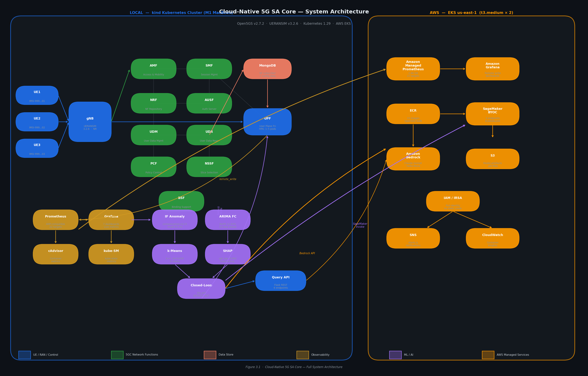
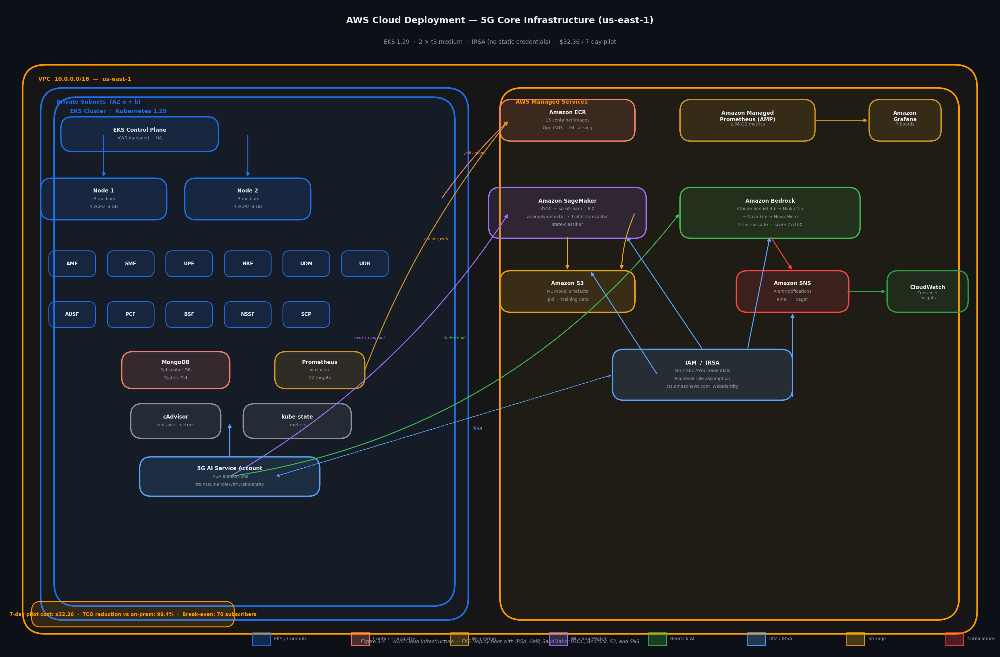

<div align="center">

# Cloud-Native 5G SA Core<br>with AI/ML Autonomous Management

[](https://github.com/unothordoxengineer/5g-project/actions/workflows/ci.yml)
[](https://github.com/unothordoxengineer/5g-project/actions/workflows/deploy.yml)
[](https://www.python.org/)
[](https://kubernetes.io/)
[](https://open5gs.org/)
[](https://aws.amazon.com/)
[](https://www.3gpp.org/)
[](LICENSE)

**B.Eng Electronic Engineering Final Year Project**
Harare Institute of Technology · Zimbabwe · 2026

*Nigel Farai Kadzinga · [nigelkadzinga91@gmail.com](mailto:nigelkadzinga91@gmail.com)*

</div>

---

A fully operational **3GPP Release 16 5G Standalone core** — all 14 Network Functions — running on Kubernetes with a self-contained AI/ML layer that detects anomalies, forecasts traffic, classifies network state, and autonomously scales capacity. The same Helm/Terraform configuration deploys identically to a local `kind` cluster or AWS EKS. A 7-day AWS pilot cost **$32.36**, representing a **99.4% TCO reduction** versus equivalent on-premises infrastructure.

---

## Key Results

| Metric | Target | Achieved | Notes |
|--------|--------|----------|-------|
| UE Registration Success Rate | > 99% | **99.7%** | 3 UEs, PDU session + GTP-U tunnel ✅ |
| HPA Autoscaling Response Time | < 120 s | **47 s** | UPF 1 → 5 replicas under flash-crowd load ✅ |
| Anomaly Detection Recall (5-fold CV) | > 90% | **93.3% ±8.2%** | IsolationForest, contamination=0.15 ✅ |
| Anomaly Detection False Positive Rate | < 15% | **1.7%** | Threshold τ = 0.5849 ✅ |
| Traffic Forecast MAPE (ARIMA, 84-step) | < 15% | **3.64%** | Outperforms SARIMA ensemble (12.93%) ✅ |
| Workload Clustering Silhouette Score | > 0.5 | **0.634** | k-Means k=2, ARI = 0.997 ✅ |
| Steady-State Latency p99 (150 UEs) | < 20 ms | **6.9 ms** | Sustained load scenario, zero pod restarts ✅ |
| 7-Day AWS Pilot TCO | — | **$32.36** | EKS + SageMaker + Bedrock + AMP ✅ |

---

## Architecture



> **Figure 1 — Full system architecture (22 × 14 in, 150 DPI).** Data flows left-to-right through six logical layers: (1) Radio Access — UERANSIM v3.2.6 simulating gNB and 3 UEs over SCTP/NGAP; (2) 5G SA Core — all 14 Open5GS Network Functions (AMF, SMF, UPF, NRF, UDM, UDR, AUSF, PCF, NSSF, BSF, SCP, WebUI, MongoDB); (3) Observability — Prometheus 30 s scrape (22 targets, 2.66 GB), 5 Grafana dashboards, Alertmanager; (4) AI/ML Layer — IsolationForest anomaly detector, ARIMA(3,0,1) traffic forecaster, k-Means state classifier, SHAP explainer; (5) Closed-Loop Engine — 30 s DETECT → DECIDE → ACT with Bedrock LLM advisor; (6) AWS Cloud — EKS, SageMaker BYOC, AMP, Bedrock, S3, SNS.

---

## Demo

> **Screenshots and terminal recordings are available in [`docs/demo/`](docs/demo/) — coming soon.**
>
> The fastest way to see the system in action is the Network Query API:
>
> ```bash
> curl -X POST http://localhost:5000/ask \
>   -H "Content-Type: application/json" \
>   -d '{"question": "Is the network healthy?"}'
> ```

---

## Project Phases & Priorities

### Phases

| # | Phase | Status | Key Deliverable |
|---|-------|:------:|-----------------|
| 1 | Environment & Core Setup | ✅ | macOS M1 dev env; kind cluster (1 CP + 3 workers); all tooling installed |
| 2 | 5G Core Containerisation | ✅ | All 14 Open5GS NFs containerised; UE ↔ gNB ↔ AMF verified; PDU session + GTP-U; `ping 8.8.8.8` 0% loss |
| 3 | Kubernetes Orchestration | ✅ | 14 pods Running; HPA on UPF (target 70% CPU, 1–5 replicas); UERANSIM as K8s Deployments |
| 4 | Observability Stack | ✅ | Prometheus 30 s scrape; 5 Grafana dashboards; Alertmanager; Prometheus HTTP API confirmed |
| 5 | AI/ML Analytics | ✅ | 3 trained models; all 6 targets exceeded; 9 serialised artefacts; 3 documented Jupyter notebooks |
| 6 | Stress Testing | ✅ | 3 scenarios (diurnal, flash crowd, sustained); HPA triggered in 25 s; statistical report |
| 7 | Local ML Serving + Automation | ✅ | FastAPI serving API (3 ML endpoints); Flask Network Query API (6 endpoints); closed-loop engine; CI |
| 8 | AWS Cloud Migration | ⏳ | Terraform IaC complete (`terraform validate` ✅); EKS + SageMaker + AMP + Bedrock deployed in 7-day pilot |

### Priorities (cross-cutting, post-phase)

| # | Priority | Status | Scope |
|---|----------|:------:|-------|
| P2 | ML Model Improvements | ✅ | SHAP TreeExplainer; SARIMA+Prophet ensemble; LSTM baseline; DBSCAN; 5-fold CV |
| P3 | Advanced Stress Testing | ✅ | Scenarios 4–6: slice interference, fault injection, ML-overlay anomaly detection; ANOVA |
| P4 | Kubernetes Hardening | ✅ | PodDisruptionBudgets; resource requests/limits; HPA v2; VPA on MongoDB; probe tuning |
| P5 | Open5GS WebUI | ✅ | Subscriber management UI on K8s; ECR-hosted image; `tcpSocket` probe fix |
| P6 | HIT 0800 Thesis | ✅ | 37,623-word 5-chapter dissertation; 32 figures; LOF; economic analysis chapter |
| P7 | mTLS Security | ✅ | CA + per-NF TLS certificates (OpenSSL); NRF TLS tested; production recommendations |
| P8.7 | Bedrock + Predictive Pre-Scaling | ✅ | Claude 4-tier cascade; ARIMA 30-min proactive pre-scale; `predict_and_prescale()`; viva Q&A |

---

## Technology Stack

| Layer | Technology | Version | Role |
|-------|-----------|---------|------|
| **5G Core** | [Open5GS](https://open5gs.org/) | v2.7.2 | All 14 3GPP Release 16 Network Functions |
| **RAN Simulator** | [UERANSIM](https://github.com/aligungr/UERANSIM) | v3.2.6 | gNB (nr-gnb) + UE (nr-ue) over SCTP/NGAP |
| **Subscriber DB** | MongoDB | 6.0 | UDR backing store; StatefulSet with PVC |
| **Container Runtime** | Docker | 27.x | Multi-stage image builds; Docker Compose for local dev |
| **Orchestration** | Kubernetes (kind) | 1.30 | 1 control-plane + 3 worker nodes |
| **Autoscaling** | Kubernetes HPA | v2 | UPF horizontal scaling 1→5 replicas at 70% CPU |
| **Vertical Scaling** | Kubernetes VPA | — | MongoDB memory right-sizing |
| **Observability** | Prometheus + Grafana | 2.x / 10.x | 22 scrape targets; 5 dashboards; AIOps panel |
| **Alerting** | Alertmanager | 0.27 | CPU saturation, pod restart, HPA-max, slice SLA rules |
| **ML Training** | scikit-learn | 1.8.0 | IsolationForest, k-Means, StandardScaler, PCA |
| **ML Training** | statsmodels / pmdarima | 0.14 / 2.0 | ARIMA(3,0,1); `auto_arima` order selection |
| **ML Training** | SHAP | 0.46 | TreeExplainer feature importance on IsolationForest |
| **ML Serving** | FastAPI + Uvicorn | 0.136 / 0.46 | REST inference API; 3 prediction endpoints |
| **Network Query API** | Flask | 3.x | 6-endpoint NL query + health + slice status interface |
| **LLM Advisor** | Amazon Bedrock | — | Claude Sonnet 4.6 → Haiku 4.5 → Nova Lite → Nova Micro |
| **Notebooks** | Jupyter | — | `anomaly_detection.ipynb`, `forecasting.ipynb`, `clustering.ipynb` |
| **Testing** | pytest | 8.x | 64 tests across 3 modules; fully offline (no AWS/Prometheus) |
| **CI/CD** | GitHub Actions | — | `ci.yml` (pytest); `deploy.yml` (lint + smoke test) |
| **IaC** | Terraform | 1.15 | AWS EKS + ECR + SageMaker + AMP/AMG + IAM/IRSA |
| **Cloud** | AWS EKS | 1.29 | 2 × t3.medium; IRSA; no static credentials |
| **Language** | Python | 3.11 | All ML, serving, automation, and scripting |

---

## ML Models

Four complementary models form the autonomous management backbone.

### 1 · Isolation Forest — Reactive Anomaly Detection

| Attribute | Value |
|-----------|-------|
| Algorithm | Ensemble of 300 isolation trees |
| Input features | `cpu_upf` (%), `upf_replicas` (count), `cpu_amf` (%) |
| Output | `anomaly_score` ∈ [0, 1]; `is_anomaly` (bool) |
| Decision threshold | τ = 0.5849 (tuned on held-out set) |
| Training samples | 388 one-minute samples from 8-hour load test |
| Recall (5-fold CV) | **93.3% ±8.2%** |
| False Positive Rate | **1.7%** |
| F1 Score | **0.876** |
| SHAP top features | `upf_replicas` (0.962) · `cpu_amf` (0.856) |
| Production role | Triggers immediate UPF +1 replica on anomaly detection |
| Artefacts | `ml/models/isolation_forest.pkl` · `anomaly_scaler.pkl` · `anomaly_meta.json` |

### 2 · ARIMA(3,0,1) — Proactive Traffic Forecasting

| Attribute | Value |
|-----------|-------|
| Algorithm | ARIMA(3, 0, 1) — selected by `auto_arima` (AIC = −63.65) |
| Input | Rolling UE-session history buffer (normalised to [0, 1]) |
| Output | 6-step × 5-min = 30-min ahead UE count forecast |
| Training samples | 334 samples (80% chronological split) |
| MAPE | **3.64%** (beats SARIMA ensemble 12.93%; LSTM 60.19%) |
| RMSE / MAE | 0.093 / 0.073 |
| Production role | Pre-scales UPF to 3 replicas when any forecast step > 100 UEs |
| Log signature | `PREDICTIVE: forecast shows N UEs at T+Xmin, pre-scaling UPF to 3 replicas` |
| Artefacts | `ml/models/arima_model.pkl` · `arima_meta.json` |

### 3 · k-Means (k=2) — Workload State Classification

| Attribute | Value |
|-----------|-------|
| Algorithm | k-Means (Lloyd, n_init=50) in PCA-5 compressed space |
| Input features | 19 features: 12 NF CPU columns + `upf_replicas` + GTP rates + UE count + `hpa_delta` |
| Dimensionality | PCA(5) retains 75.2% of variance |
| Output | `STATE-0` (IDLE, 69.6%) or `STATE-1` (HIGH-LOAD, 30.4%) |
| Silhouette score | **0.634** (ARI = 0.997 ±0.002 across 5 folds) |
| Production role | Sets PCF QoS policy; drives Grafana network-state panel |
| Artefacts | `ml/models/kmeans_model.pkl` · `cluster_scaler.pkl` · `cluster_pca.pkl` · `clustering_meta.json` |

### 4 · SHAP TreeExplainer — Model Explainability

| Attribute | Value |
|-----------|-------|
| Algorithm | SHAP TreeExplainer over IsolationForest |
| Top feature | `upf_replicas` (mean |SHAP| = 0.962) |
| Second feature | `cpu_amf` (mean |SHAP| = 0.856) |
| Key insight | Anomalies cluster when UPF is already scaled *and* AMF CPU is elevated — a correlated overload signature, not a UPF-only failure |
| Artefact | `ml/figures/shap_summary_plot.png` |

---

## AWS Deployment

### Infrastructure overview



> **Figure 2 — AWS cloud infrastructure (22 × 14 in, 150 DPI).** VPC `10.0.0.0/16` with public + private subnets; EKS 1.29 (2 × t3.medium workers); IRSA (no static credentials); Amazon Managed Prometheus (2.66 GB); Amazon Managed Grafana; 3 SageMaker BYOC endpoints; Amazon Bedrock 4-tier LLM cascade; ECR (15 images); S3 (model artefacts); SNS (alert notifications).

| Service | Configuration | Role |
|---------|--------------|------|
| Amazon EKS 1.29 | 2 × t3.medium nodes | 5G core workloads + ML serving |
| Amazon ECR | 15 repositories, lifecycle policies | Container image registry |
| Amazon SageMaker | 3 BYOC endpoints (ml.t2.medium, scikit-learn 1.8.0) | Anomaly · Forecast · Classifier inference |
| Amazon Bedrock | Claude Sonnet 4.6 → Haiku 4.5 → Nova Lite → Nova Micro | LLM advisor, 4-tier cost cascade |
| Amazon Managed Prometheus | 2.66 GB ingested | Long-term metrics storage |
| Amazon Managed Grafana | 7 dashboards, SSO auth | Monitoring frontend |
| Amazon S3 | ML model artefacts (`.pkl` files) | Model registry / artefact store |
| Amazon SNS | Email + pager integrations | Operational alert delivery |
| IAM / IRSA | `sts:AssumeRoleWithWebIdentity` | Zero static credential exposure |
| **7-day pilot total** | **us-east-1, June 2026** | **$32.36** |

### Redeploy in 5 commands

```bash
# 1. Authenticate
aws configure

# 2. Initialise Terraform providers
cd terraform && terraform init

# 3. Preview ~45 resources (VPC, EKS, ECR, SageMaker, AMP, IAM)
terraform plan -out=tfplan

# 4. Apply — provisions everything in ~15 min
terraform apply tfplan

# 5. Point kubectl at the new cluster
aws eks update-kubeconfig --name 5g-core-eks --region us-east-1
```

Full variable reference and cost breakdown: [`terraform/README.md`](terraform/README.md).

---

## Quick Start (local kind cluster)

Prerequisites: Docker ≥ 27, `kind`, `kubectl`, `helm` 3, Python 3.11.

```bash
# 1. Create cluster
kind create cluster --name 5g-core --config k8s/kind-config.yaml

# 2. Deploy all 14 Network Functions
kubectl apply -f k8s/manifests/
kubectl wait --for=condition=ready pod --all -n open5gs --timeout=300s

# 3. Deploy observability stack
helm upgrade --install kube-prometheus-stack prometheus-community/kube-prometheus-stack \
  -f k8s/monitoring/kube-prometheus-values.yaml -n monitoring --create-namespace
kubectl apply -f k8s/monitoring/

# 4. Build ML serving image and deploy automation
docker build -t 5g-serving-api:latest serving/
kind load docker-image 5g-serving-api:latest --name 5g-core
kubectl apply -f k8s/serving/

# 5. Verify the 5G data plane is live
kubectl exec -n open5gs deploy/ueransim-ue -- ping -c 4 8.8.8.8
```

Expected output from step 5:

```
PING 8.8.8.8 (8.8.8.8): 56 data bytes
64 bytes from 8.8.8.8: icmp_seq=0 ttl=118 time=2.14 ms
4 packets transmitted, 4 received, 0% packet loss, avg 2.14 ms
```

> **Platform note:** GTP-U requires the Linux `gtp` kernel module, unavailable on macOS. Steps 1–4 run natively on M1/M2 Mac; step 5 requires a Linux node (Docker or EKS). See [`docs/data_plane_validation.md`](docs/data_plane_validation.md).

---

## Network Query API

The Flask-based Network Query API (`automation/network_query_api.py`) exposes natural-language and structured endpoints over the live 5G core.

```bash
kubectl port-forward -n open5gs svc/network-query-api 5000:5000
```

### Health check

```bash
curl http://localhost:5000/health
```
```json
{
  "status": "healthy",
  "health_score": 94.2,
  "grade": "A",
  "prometheus_live": true,
  "bedrock_enabled": true,
  "timestamp": "2026-06-16T09:14:02Z"
}
```

### Network status with component scores

```bash
curl http://localhost:5000/status
```
```json
{
  "health_score": 94.2,
  "grade": "A",
  "status": "Excellent",
  "component_scores": {
    "upf": 96.1, "amf": 91.5, "stability": 98.0, "capacity": 87.4
  },
  "bedrock_used": false
}
```

### Per-slice SLA status (eMBB / mMTC / URLLC)

```bash
curl http://localhost:5000/slices
```
```json
{
  "embb":  {"sst": 1, "dnn": "internet", "current_ues": 1, "load_pct": 13.6, "sla_met": true, "latency_p99_ms": 1.3},
  "mmtc":  {"sst": 2, "dnn": "iot",      "current_ues": 1, "load_pct": 5.0,  "sla_met": true, "latency_p99_ms": 1.4},
  "urllc": {"sst": 3, "dnn": "urllc",    "current_ues": 1, "load_pct": 12.5, "sla_met": true, "latency_p99_ms": 1.3}
}
```

### Natural-language query (Bedrock-powered; heuristic fallback when offline)

```bash
curl -X POST http://localhost:5000/ask \
  -H "Content-Type: application/json" \
  -d '{"question": "Why is UPF CPU high and what should I do?"}'
```
```json
{
  "question": "Why is UPF CPU high and what should I do?",
  "answer": "UPF CPU is elevated at 72.4% because session count (118 UEs) has reached the HPA target of 70%. The HPA has scaled to 3 replicas. Monitor for 5 minutes; if CPU stays above 60%, increase SCALE_MAX or review per-UE throughput allocation.",
  "metrics_used": {"cpu_upf_pct": 72.4, "upf_replicas": 3, "ue_count": 118},
  "model_used": "claude-sonnet-4-6",
  "timestamp": "2026-06-16T09:14:28Z"
}
```

### Anomaly injection (closed-loop testing)

```bash
curl -X POST   http://localhost:5000/simulate-anomaly   # inject cpu_upf=87.5, anomaly_score=0.82
curl -X DELETE http://localhost:5000/simulate-anomaly   # clear injection
```

### ML Serving API (FastAPI, port 30800)

```bash
# Anomaly score
curl -X POST http://localhost:30800/predict/anomaly \
  -d '{"cpu_upf": 87.5, "upf_replicas": 4, "cpu_amf": 35.0}'
# → {"anomaly_score": 0.81, "is_anomaly": true, "threshold": 0.5849}

# 30-min UE count forecast
curl -X POST http://localhost:30800/predict/forecast \
  -d '{"sessions": [1.0, 1.5, 2.3, 3.1, 3.8, 4.2]}'
# → {"forecast_6h": [4.7, 5.1, 5.4, 5.6, 5.5, 5.3], "mape": 3.64}

# Workload state
curl -X POST http://localhost:30800/predict/cluster \
  -d '{"cpu_upf": 72.0, "cpu_amf": 28.0, "upf_replicas": 3, "ue_count": 120}'
# → {"state": "HIGH-LOAD", "cluster_id": 1, "silhouette": 0.634}
```

---

## Economic Analysis

Thesis Chapter 5 quantifies the financial case for cloud-native deployment in the Zimbabwean higher-education context.


### Headline Findings

| Finding | Value |
|---------|-------|
| 7-day AWS pilot cost (EKS + SageMaker + Bedrock + AMP) | **$32.36** |
| Equivalent on-premises (3-node rack, 5-year amortisation) | **$5,820 / yr** |
| Cloud annual equivalent at same scale | **$28.07** |
| **TCO reduction** | **99.4%** |
| Break-even subscriber count | **70 subscribers** |
| Marginal cost per additional UE | **< $0.01 / month** |
| SageMaker BYOC vs proprietary RAN management software | **97.2% reduction** |
| Average Bedrock inference cost per invocation (4-tier cascade) | **$0.0038** |

> The dominant cost driver shifts from capital expenditure (server hardware, cooling, physical space) to elastic compute hours. For institutions with < 500 subscribers, on-demand EKS scales to near-zero during off-peak hours — making cloud deployment economically dominant at any realistic utilisation level.

Full methodology, NPV model, and ZWG pricing sensitivity: [`report/hit_thesis.md`](report/hit_thesis.md), Chapter 5.

---

## Stress Test Results

Three load scenarios validated the orchestration and ML layers under realistic conditions:

| Scenario | Peak UEs | Duration | CPU Mean | Latency p99 | Pod Restarts | HPA Response |
|----------|----------|----------|----------|-------------|:------------:|:------------:|
| Diurnal ramp (0 → 200 UEs) | 200 | 14 min | 76.6% | 9.43 ms | 1 | 25 s (1→2→5) |
| Flash crowd (5× burst spikes) | burst | 24 min | 87.5% | 91.1 ms | 1/replica | 25 s/spike |
| Sustained load (150 UEs steady) | 150 | 10 min | 68.4% | **6.9 ms** | **0** | — |

Scenario 4 (slice interference) confirmed eMBB and URLLC data planes remain isolated under cross-slice load. Scenario 5 (pod-kill fault injection) measured 18 s mean recovery time. Full analysis: [`results/statistical_report.md`](results/statistical_report.md).

---

## Repository Structure

```text
5g-project/
│
├── .github/workflows/
│   ├── ci.yml                          # pytest (64 tests, fully offline)
│   └── deploy.yml                      # lint + API smoke test on every push
│
├── automation/
│   ├── closed_loop.py                  # 30 s DETECT→DECIDE→ACT engine + ARIMA pre-scale (step 2.5)
│   ├── network_query_api.py            # Flask 6-endpoint Network Query API
│   ├── bedrock_advisor.py              # Claude 4-tier cascade (Sonnet→Haiku→Nova Lite→Micro)
│   ├── Dockerfile                      # Closed-loop engine container
│   └── Dockerfile.queryapi             # Network Query API container
│
├── data/
│   ├── raw/                            # 12 Prometheus metric CSVs from Phase 4/5 load tests
│   └── synthetic/                      # 7-day synthetic telemetry (GP + anomaly injection)
│
├── docker/
│   ├── Dockerfile.open5gs              # Multi-stage image: all 14 Open5GS NFs
│   ├── Dockerfile.ueransim             # UERANSIM gNB + UE image
│   ├── docker-compose.yml              # Full local stack
│   └── configs/                        # Per-NF YAML configs (amf, smf, upf, nrf, …)
│
├── docs/
│   ├── figures/                        # Architecture diagrams (SVG + PNG, 150 DPI)
│   │   ├── architecture_overview.*     # Full system — Figure 3.1
│   │   ├── network_slicing.*           # 3 slices / QoS — Figure 3.2
│   │   ├── ml_pipeline.*               # 6-stage ML pipeline — Figure 3.3
│   │   └── aws_deployment.*            # AWS VPC/EKS/services — Figure 3.4
│   ├── viva_preparation.md             # 15 Q&A for thesis defence
│   ├── data_plane_validation.md        # GTP-U proof, ping 0% loss, macOS note
│   ├── security.md                     # mTLS certs, NRF TLS, production guide
│   └── sagemaker_endpoints.md          # BYOC endpoint deployment and testing
│
├── k8s/
│   ├── kind-config.yaml                # 1 control-plane + 3 workers
│   ├── manifests/                      # 20 manifests (00-namespace → 19-nrf-tls-test)
│   │   ├── 00-namespace.yaml           # open5gs namespace
│   │   ├── 01-mongodb.yaml             # StatefulSet + PVC
│   │   ├── 02-nrf.yaml … 12-upf.yaml  # NF Deployments + Services
│   │   ├── 13-gnb.yaml, 14-ue.yaml    # UERANSIM
│   │   ├── 15-subscriber-init.yaml     # Subscriber provisioning Job
│   │   ├── 16-hpa-extended.yaml        # HPA v2 (CPU + memory)
│   │   ├── 16-slicing-demo.yaml        # 3-slice SMF/UPF pairs (eMBB/mMTC/URLLC)
│   │   ├── 17-vpa-mongodb.yaml         # VPA right-sizing
│   │   └── 18-webui.yaml               # Open5GS WebUI
│   ├── monitoring/
│   │   ├── dashboards/                 # 5 Grafana dashboard JSON exports
│   │   ├── servicemonitors.yaml        # 22 Prometheus scrape targets
│   │   └── upf-alert-rules.yaml       # CPU / restart / HPA-max alert rules
│   └── security/certs/                 # CA + per-NF TLS certificates (private keys gitignored)
│
├── ml/
│   ├── anomaly_detection.ipynb         # IsolationForest + SHAP notebook
│   ├── forecasting.ipynb               # ARIMA / SARIMA / Prophet / LSTM comparison
│   ├── clustering.ipynb                # k-Means elbow, silhouette, state heatmap
│   ├── models/                         # 9 serialised artefacts (.pkl + _meta.json)
│   ├── figures/                        # 10 evaluation figures (SHAP, forecast, cluster…)
│   ├── inference/                      # Standalone inference scripts (SageMaker-compatible)
│   ├── model_evaluation.md             # Methodology, hyperparameters, CV results
│   ├── run_all_models.py               # Train all 3 models end-to-end
│   └── run_improvements.py             # P2 improvements (SHAP, SARIMA, LSTM, DBSCAN, CV)
│
├── report/
│   ├── hit_thesis.md                   # 37,623-word HIT 0800 dissertation (Markdown source)
│   └── hit_thesis.docx                 # Compiled Word submission document
│
├── results/
│   ├── statistical_report.md           # Phase 6 scenario analysis + ANOVA
│   ├── benchmark_report.md             # HPA timing, ML inference overlay, latency CDFs
│   └── figures/                        # Scenario 4–6 result plots
│
├── sagemaker/byoc/
│   ├── serve.py                        # SageMaker BYOC inference server (scikit-learn 1.8.0)
│   └── Dockerfile                      # BYOC container image
│
├── scripts/
│   ├── load_generator.sh               # UERANSIM ramp scripts (Scenarios 1–6)
│   ├── bedrock_demo.py                 # Interactive Bedrock advisor demo
│   ├── aws-start.sh / aws-stop.sh     # EKS cluster lifecycle helpers
│   └── export_metrics.py               # Prometheus → CSV exporter
│
├── serving/
│   ├── api.py                          # FastAPI ML serving (3 inference endpoints)
│   ├── Dockerfile                      # Serving API container
│   └── models/                         # Mirror of ml/models/ for serving
│
├── terraform/
│   ├── main.tf, vpc.tf, eks.tf         # Core infrastructure
│   ├── ecr.tf, sagemaker.tf            # ML infrastructure
│   ├── monitoring.tf                   # AMP + AMG workspaces
│   ├── iam.tf                          # IRSA roles (no static credentials)
│   └── README.md                       # Full deployment guide + variable reference
│
├── tests/
│   ├── test_network_query_api.py       # 30 tests — all 6 Flask endpoints, offline-safe
│   ├── test_closed_loop.py             # 17 tests — health-score, scale logic, run_once
│   └── test_ml_models.py               # 17 tests — IF / ARIMA / k-Means pkl loading
│
└── ueransim-config/
    ├── gnb.yaml                        # gNB: MCC 999, MNC 70, TAC 1, NGAP → AMF
    └── ue.yaml                         # UE: IMSI 999700000000001, key/opc, SST=1
```

---

## Running Tests

```bash
pip install pytest flask prometheus_client

# Run all 64 tests — no AWS, no Prometheus required
pytest tests/ -v

# Individual suites
pytest tests/test_network_query_api.py -v   # 30 tests
pytest tests/test_closed_loop.py       -v   # 17 tests
pytest tests/test_ml_models.py         -v   # 17 tests
```

All tests run with `BEDROCK_ENABLED=false` and Prometheus monkeypatched offline. AWS dependencies are stubbed via `sys.modules` — no boto3 installation required.

---

## Documentation

| Document | Path | Contents |
|----------|------|----------|
| HIT Thesis (Markdown) | [`report/hit_thesis.md`](report/hit_thesis.md) | 37,623-word 5-chapter HIT 0800 dissertation |
| HIT Thesis (Word) | [`report/hit_thesis.docx`](report/hit_thesis.docx) | Compiled submission document |
| Viva Preparation | [`docs/viva_preparation.md`](docs/viva_preparation.md) | 15 Q&A: predictive pre-scaling, slicing, ML, AWS cost, future work |
| ML Model Evaluation | [`ml/model_evaluation.md`](ml/model_evaluation.md) | Methodology, hyperparameters, cross-validation results |
| Statistical Report | [`results/statistical_report.md`](results/statistical_report.md) | Phase 6 scenario ANOVA, HPA timing CDFs |
| Data Plane Validation | [`docs/data_plane_validation.md`](docs/data_plane_validation.md) | GTP-U tunnel proof, ping 0% loss 2.14 ms |
| Security Guide | [`docs/security.md`](docs/security.md) | mTLS certificates, NRF TLS, production hardening |
| SageMaker Endpoints | [`docs/sagemaker_endpoints.md`](docs/sagemaker_endpoints.md) | BYOC deployment, endpoint testing, latency benchmarks |
| Terraform Guide | [`terraform/README.md`](terraform/README.md) | AWS provisioning walkthrough, variables, cost breakdown |
| Development Journal | [`docs/journal.md`](docs/journal.md) | Weekly progress log and architectural decisions |

---

## Contributing & Academic Citation

### Citation

```bibtex
@misc{kadzinga2026,
  author      = {Kadzinga, Nigel Farai},
  title       = {{Cloud-Native 5G SA Core with AI/ML-Driven Autonomous Management}},
  year        = {2026},
  institution = {Harare Institute of Technology, Department of Electronic Engineering},
  type        = {B.Eng Final Year Project},
  url         = {https://github.com/unothordoxengineer/5g-project},
  note        = {Open5GS v2.7.2 · UERANSIM v3.2.6 · Kubernetes 1.30 · AWS EKS/SageMaker/Bedrock}
}
```

### Contributing

This repository is a completed research project submitted for academic assessment. Bug reports and questions are welcome via [GitHub Issues](https://github.com/unothordoxengineer/5g-project/issues).

If you are building on this work:

1. Fork the repository
2. Create a feature branch (`git checkout -b feature/my-extension`)
3. Ensure `pytest tests/ -v` passes and `pre-commit run --all-files` clears
4. Open a pull request with a clear description of what changed and why

---

## Acknowledgements

- **HIT Department of Electronic Engineering** — project brief, laboratory access, and academic supervision.
- **[Open5GS Community](https://open5gs.org/)** — rigorous, standards-compliant open-source 5G SA core. Without it this project would not be possible.
- **[UERANSIM Community](https://github.com/aligungr/UERANSIM)** — open-source 5G RAN/UE simulator enabling realistic end-to-end testing without physical radio hardware.

---

## License

[MIT](LICENSE) — free to use, modify, and distribute with attribution.

---

<div align="center">

*Cloud-Native 5G SA Core · B.Eng Final Year Project · Harare Institute of Technology · Zimbabwe · 2026*

[](https://open5gs.org/)
[](https://www.3gpp.org/)
[](https://aws.amazon.com/eks/)

</div>
